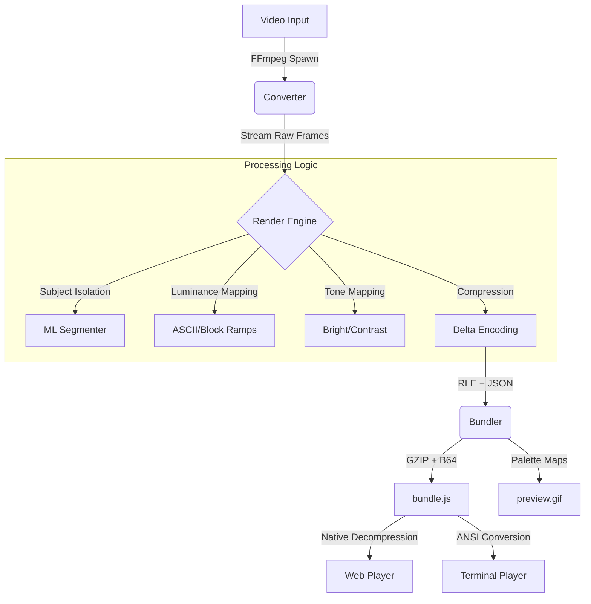

# ASCII-fi

| Original (3.0mb)               | ASCII Preview (0.3mb)    |
| ------------------------------ | ------------------------ |
|  |  |

**ASCII-fi** is a high-performance video-to-ASCII conversion engine. It features a lightweight resource footprint and is optimised for both visual fidelity and storage efficiency. With support for real-time bundle size estimation, automatic vertical video orientation, and high-precision colour quantisation, ASCII-fi transforms any video into stunning, portable ASCII animations for the web or terminal.

It operates seamlessly as a **Standalone Interactive CLI/GUI** and as a **Programmatic NPM Library**, allowing for flexible standalone consumption or direct integrations inside your backend environments.

---

## ✨ Key Features
- **Live Webcam Preview**: Full-area ASCII rendering directly from your camera.
- **Real-time Reactivity**: ASCII output responds instantly to UI sliders (Width, Colour Mode, Brightness, Contrast).
- **Foreground Isolation**: Toggle ML-powered segmentation (via ONNX) to isolate subjects.
- **Live Bundle Estimates**: See real-time file size predictions for both `preview.gif` and `bundle.js`.
- **Raw .js Viewer**: Switch between the live player and the generated source code.
- **Efficiency**: Stream-based processing handles up to 4K video without disk-swapping or memory overflows.

---

## 🚀 Quick Start

### Prerequisites
- **Node.js >= 18**
- **FFmpeg** (automatically handled via `ffmpeg-static` bindings)
- **Modern Terminal**: For optimal CLI playback, use a terminal with full GPU acceleration (e.g., **Windows Terminal**, **macOS Terminal**, or **iTerm2**).

### Installation
Currently, `ASCII-fi` is not distributed on the npm registry. You can install it directly from GitHub:

```bash
git clone https://github.com/iman-hussain/ASCII-fy.git
cd ASCII-fy
npm install

# (Optional) Link it to use the "ASCII-fi" command globally
npm link
```

---

## 🖥️ GUI Usage

ASCII-fi ships with an integrated local Web UI enabling real-time tweaks and live previews. **This is the fastest way to get started.**

1. Navigate to the installation directory.
2. **Windows**: Run `start.bat`
3. **macOS/Linux**: Run `./start.sh`

---

## 🖥️ CLI Usage

If installed globally (or running locally via `npm start`), you can initiate `ASCII-fi` via the command line.

```bash
# Interactive mode (Prompts you step-by-step for files and settings)
ASCII-fi

# Fast-CLI mode (Bypasses prompts entirely for rapid execution)
ASCII-fi input/dog.mp4 --width 120 --fps 30 --mode truecolor
```

### 🎮 Terminal Playback
Once you have generated an animation (typically saved as `bundle.js`), you can play it natively in your terminal:

```bash
# Play a bundle in your terminal
node scripts/ascii-player.js output/dog/bundle.js
```

> [!NOTE]
> **Performance:** For the best experience (smooth 60fps truecolour), use a terminal with full GPU acceleration. Choose a small width (e.g., 60-80 columns) for optimal performance.

---

## 📊 Platform Feature Comparison

| Feature | Web Preview | GUI | CLI |
|---------|-------------|-----|-----|
| Custom Colour Palettes | ✅ | ✅ | ✅ |
| Brightness/Contrast | ✅ | ✅ | ✅ |
| Character vs Block Mode | ✅ | ✅ | ✅ |
| Web Player Bundle (JS) | ✅ | ✅ | ✅ |
| GIF Preview | ✅ | ✅ | ✅ |
| Webcam Input | ✅ | ✅ | ✅ |
| File Upload | ❌ | ✅ | ✅ |
| Trimming (Start/End) | ❌ | ✅ | ✅ |
| Subject Isolation (ML) | ❌ | ✅ | ✅ |
| Terminal Playback | ❌ | ✅ | ✅ |
| Cropping | ❌ | ✅ | ✅ |
| Real-time Preview | ✅ | ✅ | ❌ |
| Batch Processing | ❌ | ❌ | ✅ |
| Programmatic API | ❌ | ❌ | ✅ |
| Configuration Files | ❌ | ❌ | ✅ |

---

## 🛠️ Programmatic API

When importing `ascii-fi`, you receive access to the full video generation capabilities and an inline Terminal Player.

### 1. Generating Bundles
```js
import { generateBundle } from 'ascii-fi';

try {
  const result = await generateBundle({
    inputFile: 'input/my-video.webm',
    width: 80,
    fps: 24,
    mode: 'truecolor',
    skipGif: true
  });

  console.log('Bundle Saved To:', result.bundlePath);
  console.log('Statistics:', result.stats);
} catch (err) {
  console.error("Conversion failed:", err.message);
}
```

---

## 🛠️ Architecture & Efficiency

- **Stream-based processing** – FFmpeg pipes raw frames directly to Node.js; no temporary files are written to disk.
- **Resolution-safe downscaling** – Input videos are downscaled before processing to prevent memory overflows.
- **Resource Constraints** – Maintains a highly restricted memory footprint suitable for tiny shared VPS hosting.
- **Binary payloads** – Output web bundles utilise raw binary serialisation and GZIP compression for minimal file sizes.

---

### Available CLI Flags

| Flag                   | Description                                                                       | Default     |
| ---------------------- | --------------------------------------------------------------------------------- | ----------- |
| `<file>`               | The positional argument specifying the video path                                 | -           |
| `-w, --width <n>`      | Output character width                                                            | 100         |
| `-f, --fps <n>`        | Output playback frame rate                                                        | 24          |
| `-m, --mode <mode>`    | Colour styling (`truecolor`, `mono`, `palette`, `kmeans`)                         | `truecolor` |
| `-d, --depth <n>`      | Palette colour calculation density (2-64)                                         | 16          |
| `-p, --palette <name>` | Preset selections (`realistic`, `grayscale`, `sunset`, `ocean`, `neon`, `forest`) | -           |
| `--fg <hex>`           | Mono mode foreground colour                                                       | `#00ff00`   |
| `--bg <hex\|auto>`     | Mono mode and player background colour                                            | `#000000`   |
| `-g, --char-mode`      | Mode style (`ascii` edge detection or `block` solid colours)                      | `ascii`     |
| `-s, --start <sec>`    | Video slice starting point (seconds)                                              | -           |
| `-e, --end <sec>`      | Video slice ending point (seconds)                                                | -           |
| `--no-gif`             | Skip GIF preview generation                                                       | -           |
| `--no-open`            | Skip opening the browser/HTML automatically on completion                         | -           |

---

## 🏗️ Architecture & Pipeline

The following diagram illustrates the internal flow from raw video input to the final compressed web bundle.



---

## 📁 Project Structure

```text
ASCII-fi/
├── gui/                   # Web-based interface source
│   ├── js/                # Client-side logic (UI, API, State)
│   ├── server.js          # Node.js backend for GUI and conversion API
│   ├── index.html         # Main dashboard layout
│   └── style.css          # Design system and animations
├── lib/                   # Core conversion library
│   ├── api.js             # High-level programmatic entry points
│   ├── bundler.js         # Final payload generation (GZIP, Binary)
│   ├── converter.js       # FFmpeg orchestration and frame streaming
│   ├── gif.js             # Palettised GIF generation with transparency
│   ├── kmeans.js          # Colour quantization logic
│   ├── player.js          # Shared web-player source template
│   ├── render.js          # Per-pixel ASCII/Block processing
│   ├── terminal-player.js # Node-native ANSI playback engine
│   └── tone.js            # Brightness, Contrast, and Detail filters
├── scripts/               # Standalone helper utilities
│   └── ascii-player.js    # Zero-dependency terminal playback script
├── models/                # ML models for foreground isolation
├── tests/                 # Integration and performance benchmarks
├── index.js               # CLI entry point and argument parsing
├── start.bat / .sh       # Platform-specific GUI launchers
└── README.md              # Technical documentation
```
