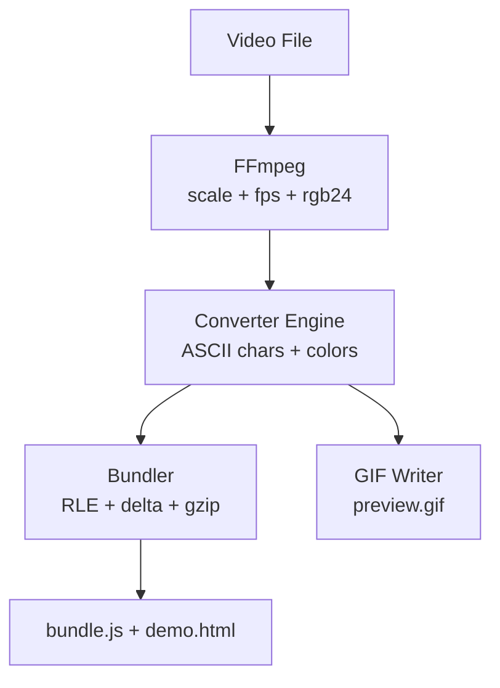

# ascii-fy

| Original | ASCII Preview |
| --- | --- |
|  |  |

High-performance CLI and GUI tool that converts video files into lightweight ASCII art animations for the web.

## Features

- **Stream-based architecture** – FFmpeg pipes raw frames directly to Node.js; no temporary files are written to disk.
- **Resolution-safe** – Input videos (720p, 1080p, 4K) are downscaled via FFmpeg before processing, preventing memory overflows.
- **RLE compression** – Generated web bundles use Run-Length Encoding for minimal file size.
- **Web playable** – Outputs a self-contained `demo.html` + `bundle.js` that plays the animation in any browser.
- **Terminal preview** – Optionally plays the ASCII animation directly in your terminal.
- **Color support** – Full 24-bit color by default, with post-conversion palettes.
- **Input types** – Supports `.mp4`, `.gif`, and `.webm` inputs.
- **Trim support** – Convert only a specific segment of a video (start/end time).
- **Live tweaks** – Adjust foreground/background colors and re-generate outputs on demand.
- **Foreground isolation** – Motion mask or ML segmentation with configurable background handling.
- **Webcam capture** – Record from your webcam and convert the recording directly.

## Installation

```bash
npm install
```

> Requires Node.js >= 18 and **FFmpeg** (bundled via `ffmpeg-static`).

## Usage

ASCII-fy ships as both a GUI app (local web UI) and a CLI tool.

### GUI

Windows:

```bat
start.bat
```

macOS/Linux:

```bash
./start.sh
```

If needed, make it executable:

```bash
chmod +x start.sh
```

### CLI

```bash
node index.js
```

The interactive CLI will prompt you for:

1. **Input file** – scans the `input/` folder for `.mp4`, `.mov`, `.webm`, etc.
2. **Output width** – target character width (default: 100).
3. **Trim (optional)** – start/end time in seconds to convert only part of the video.

The terminal preview runs automatically after conversion. You can then choose render styles like:

- Truecolor (source)
- Monochrome (custom fg/bg)
- Grayscale 4-bit / 6-bit / 8-bit
- Gradient palettes (Sunset, Ocean, Neon, Forest) or a custom 3-color gradient

The tool auto-creates `input/` and `output/` folders next to your video file if they do not already exist.
After conversion, open the generated `demo.html` in a browser to view the animation.

#### Foreground isolation

In the GUI, enable **Foreground → Isolate subject** to separate the moving subject from a static background.

- **Motion mask** – fast and lightweight (no ML).
- **ML segmentation** – higher quality but requires a model file.

Place your ONNX model at `models/selfie.onnx`. The ML option uses `onnxruntime-node`.

The start scripts will auto-download a default selfie segmentation model if it is missing. You can override the download URL with `ASCII_FY_MODEL_URL`.

#### Webcam capture

Use **Use Webcam** in the GUI, then **Start Recording** / **Stop** to convert the recording.

## Output

Each conversion writes to `output/<video-name>/`:

| File         | Description                                        |
| ------------ | -------------------------------------------------- |
| `bundle.js`  | RLE-compressed frame data + embedded `AsciiPlayer` |
| `demo.html`  | Standalone HTML page with play/stop controls       |
| `preview.gif`| ASCII GIF preview (generated from frames)          |

## Architecture



```text
ascii-fy/
├─ gui/
│  ├─ index.html   - GUI layout, controls, preview, and client logic
│  └─ server.js    - local HTTP server, API routes, and conversion runner
├─ models/         - optional ML segmentation model (selfie.onnx)
├─ lib/
│  ├─ bundler.js   - bundle.js + demo.html generator (RLE + gzip)
│  ├─ converter.js - FFmpeg stream reader and ASCII frame generator
│  ├─ gif.js       - preview.gif renderer
│  ├─ kmeans.js    - palette extraction (k-means)
│  ├─ player.js    - browser player runtime
│  ├─ preview.js   - terminal preview player
│  ├─ render.js    - palettes, ramps, and color helpers
│  └─ tone.js      - adaptive tone + sampling
├─ input/          - source videos (optional)
├─ output/         - conversion outputs per video
├─ index.js        - CLI entry point
├─ start.bat       - GUI launcher (Windows)
└─ start.sh        - GUI launcher (macOS/Linux)
```

## License

MIT
